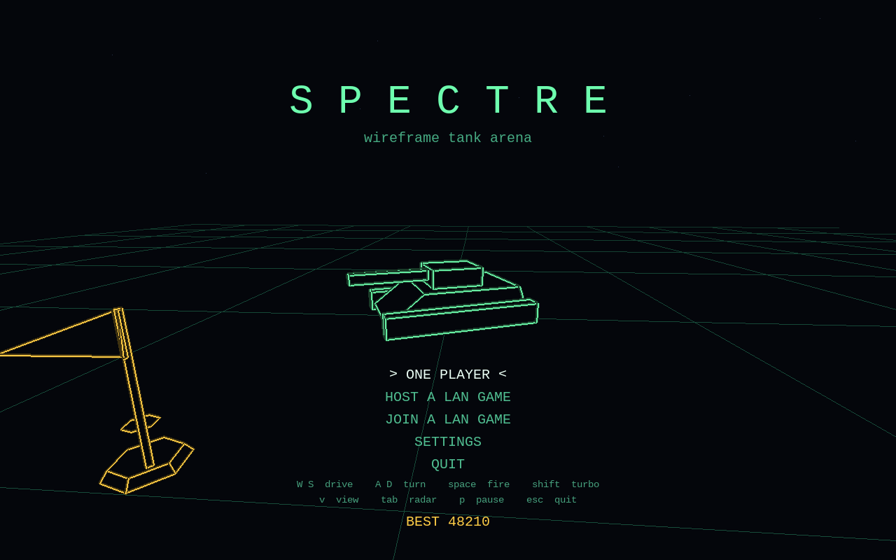
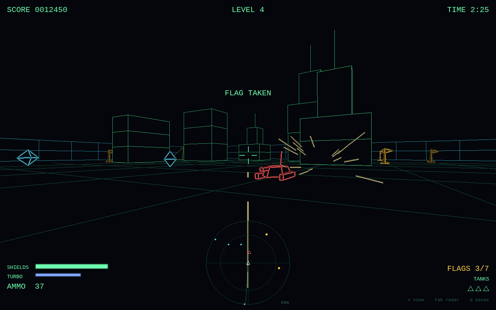
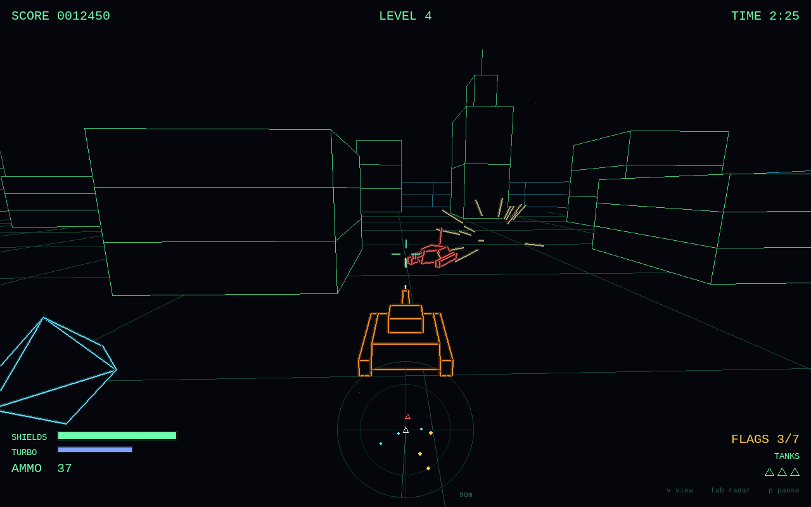
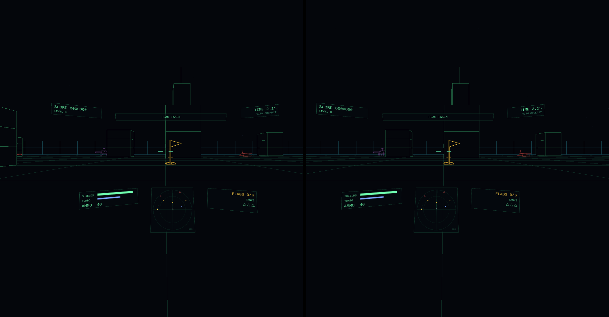

<div align="center">



# Spectre

**A wireframe tank arena, with hidden lines, LAN co-op and VR.**

A clone of *Spectre* (Velocity, 1991), written from scratch in Python and pygame.

[](LICENSE)
[](https://www.python.org/)
[](https://pyga.me/)
[](#install)
[](#vr)

[Install](#install) · [Play](#play) · [VR](#vr) · [LAN co-op](#lan-co-op) · [How it works](docs/how-it-works.md) · [Changelog](CHANGELOG.md)

</div>

---

Drive a vector tank round a walled arena, run down every flag before the clock
does, and stay out of the sights of the tanks that come looking for you.

It's all line art, but the solids are solid: faces are filled with the
background and only their front edges are drawn, so a building hides whatever
stands behind it. That's the trick that made the original Spectre's arenas feel
like places rather than diagrams. It's done here in software, in plain pygame,
fast enough to draw twice per frame for a headset.

<table>
<tr>
<td></td>
<td></td>
</tr>
<tr>
<td align="center"><sub>Cockpit view</sub></td>
<td align="center"><sub>Chase view (<code>v</code>)</sub></td>
</tr>
</table>

## Features

- **Hidden-line wireframe.** Filled faces, back-to-front painting, and seams
  sealed where two solids meet. No OpenGL is needed to play on the desk.
- **Enemies that hunt you.** Fast red **hunters** and slow, hard-hitting purple
  **sentries** track you by sight and lead their shots. Keep a building between
  you and them.
- **Steering that winds up.** Tap for half a degree of fine aim; hold, and it
  builds over 0.85 s to a full 132°/s swing, all on the same key.
- **LAN co-op for up to four.** No accounts and no servers, just an address.
  Levels are grown from a seed, so the arena is never sent over the network.
- **VR over OpenXR.** Sit in the tank with your head free to look round.
  Gauges hang in front of you, and the Touch controllers drive and fire.
  Tested with a Quest 3 over [WiVRn](https://github.com/WiVRn/WiVRn).
- **Synthesised sound.** Every effect is built at startup from oscillators and
  noise, with no sample files. Sounds are positioned in stereo, so you can hear
  which side the shots are coming from.
- **Small.** One file for the game and a second only a headset loads.

## Install

Spectre is developed on Linux (Arch). The desk game is plain pygame and ought
to run anywhere pygame does, but the installer and the VR setup are
Linux-specific.

```sh
git clone https://github.com/RB211/Spectre.git
cd Spectre
./install.sh
```

This copies the game into `~/.local/share/spectre` with a Python environment of
its own, and adds two entries to your app launcher:

| Launcher | |
|---|---|
| **Spectre** | the game on your desktop |
| **Spectre VR** | the game in a headset. It starts WiVRn if needed, and it's listed in the WiVRn app on the Quest, so you can start it from inside the headset. |

Run `./install.sh` again to update, and `./install.sh --uninstall` to remove it.
Your settings (`~/.config/spectre`) are kept. Logs go to
`~/.local/state/spectre/`.

<details>
<summary><b>Run from source instead</b></summary>

```sh
python -m venv .venv
.venv/bin/pip install -r requirements.txt
.venv/bin/python spectre.py
```

| Option | |
|---|---|
| `--fullscreen` | start full screen |
| `--mute` | no sound |
| `--vr` | play in a headset |
| `--vr-check` | check the headset side is working, without starting a session |

The desk game needs only pygame; PyOpenGL and pyopenxr are for `--vr`. In VS
Code, **Ctrl+Shift+B** starts the game in VR.

</details>

## Play

Collect every flag in the arena before the clock runs out. Octahedral pods are
ammunition and cubes are shields, and destroyed tanks drop them too. Clearing a
level pays a time bonus and adds another enemy tank.

| Key | |
|---|---|
| `W` `S` / `↑` `↓` | drive, reverse |
| `A` `D` / `←` `→` | turn (tap to aim, hold to swing round) |
| `space` | fire |
| `shift` | turbo (drains while held, refills when you let go) |
| `v` | switch between cockpit and chase camera |
| `tab` | radar range: 55 m, 90 m or 150 m |
| `p` | pause |
| `f` | fullscreen |
| `esc` | in-game menu (back to the main menu, or quit) |

## VR



Spectre runs in any OpenXR headset whose runtime supports OpenGL. It's built
and tested with a **Quest 3** streaming wirelessly over
[**WiVRn**](https://github.com/WiVRn/WiVRn):

1. Start **Spectre VR** from the app launcher, or from the WiVRn app on the
   Quest.
2. If you started it on the PC, open the WiVRn app on the Quest. The game plays
   in a window until the headset connects, then switches to it. The window then
   mirrors the left eye.

**In the headset** your head is free inside the tank: look out the side while
the tank drives straight on. The gauges hang in two rows around your gaze
(score and clock above, shields, radar and flags below) so the middle stays
clear. The reticle sits out on the gun line, and menus appear on a single
sheet in front of you. Where you're sitting when the game starts becomes your
seat; press `F12`, click the left stick, or hold the Quest's Meta button to
recenter.

If WiVRn restarts or the link drops, the game carries on in the window until
the headset reconnects.

| Touch controller | |
|---|---|
| left stick | drive, reverse and turn (the right stick turns too) |
| trigger | fire |
| grip | turbo |
| `A` / `B` | select / back (`B` or the menu button opens the in-game menu) |
| `Y` | cockpit / chase camera |
| `X` | radar range |
| right stick click | pause |
| left stick click | recenter |

You still need the keyboard to type a LAN address or your name.

## LAN co-op

Up to four tanks on the same network, over plain TCP on port 35700.

1. One player picks **HOST A LAN GAME**. The lobby shows an address to read
   out.
2. Everyone else picks **JOIN A LAN GAME** and types it in (`host:port` works
   if the port has been changed).
3. The host presses `enter` when everyone's in.

Flags and the clock are shared, scores are per player, and the enemy tanks go
after whoever is nearest. There's no friendly fire. Destroyed tanks respawn
after a moment, and the mission only fails when the clock runs out. Every other
tank flies its player's name over the turret; set yours under **SETTINGS** on
the title screen.

## Tips

**Tiling window managers.** The window's class is `spectre`, and it adapts to
whatever size the compositor gives it, even a tall, narrow tile. To float it
in Hyprland instead:

```lua
o.window("spectre", { float = true, center = true, size = { 1280, 800 } })
```

## How it works

The renderer, the hidden-line trick, the synthesised audio, the networking
and the VR pipeline are written up in
**[docs/how-it-works.md](docs/how-it-works.md)**.

## Credits

*Spectre* was created by Velocity Development and published in 1991. This is
an independent, from-scratch clone made for fun. It is not affiliated with or
endorsed by the original's authors, and it contains none of their code or
assets.

## License

Spectre is free software under the [GNU General Public License v3.0](LICENSE):
you can use, study, share and change it, and anything you distribute that's
built on it must be shared under the same terms.
